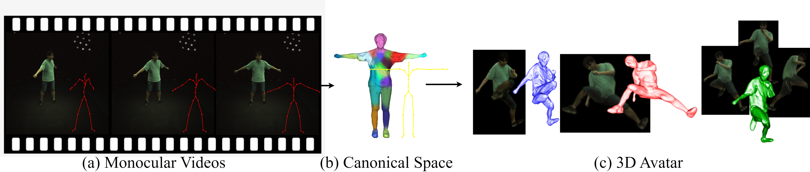

<p align="center">

  <h1 align="center">AvatarOne: Monocular 3D Human Animation</h1>
  
  <p align="center" style="font-size:16px">
    <a href="https://aku02.github.io/"><strong>Akash Karthikeyan</strong></a>
    ·
    <a href="https://robertren1122.github.io/"><strong>Robert Ren</strong></a>
    ·
    <a href="https://yashkant.github.io/"><strong>Yash Kant</strong></a>
    ·
    <a href="https://tisl.cs.toronto.edu/author/igor-gilitschenski/"><strong>Igor Gilitschenski</strong></a>
  </p>
  <p align="center" style="font-size:16px">WACV 2024</p>

  <p align="center">
  <br>
    <a href='https://openaccess.thecvf.com/content/WACV2024/papers/Karthikeyan_AvatarOne_Monocular_3D_Human_Animation_WACV_2024_paper.pdf'>Paper PDF</a>
    <a href='https://aku02.github.io/projects/avatarone/' style='padding-left: 0.5rem;'>Project Page</a>
  </p>
  <div align="center">
  </div>

  
  <br/>
  
  >Reconstructing realistic human avatars from monocular videos is a challenge that demands intricate modeling of 3D surface and articulation. 
    In this paper, we introduce a comprehensive approach that synergizes three pivotal components: 
    (1) a Signed Distance Field (SDF) representation with volume rendering and grid-based ray sampling to prune empty raysets, enabling efficient 3D reconstruction; 
    (2) faster 3D surface reconstruction through a warmup stage for human surfaces, which ensures detailed modeling of body limbs; and
    (3) temporally consistent subject-specific forward canonical skinning, which helps in retaining correspondences across frames, all of which can be trained in an end-to-end fashion under 15 minutes. 
  
  >Leveraging warmup and grid-based ray marching, along with a faster voxel-based correspondence search, our model streamlines the computational demands of the problem. We further experiment with different sampling representations to improve ray radiance approximations and obtain a floater free surface. Through rigorous evaluation, we demonstrate that our method is on par with current techniques while offering novel insights and avenues for future research in 3D avatar modeling. This work showcases a fast and robust solution for both surface modeling and novel-view animation.
</p>

---

## Installation
```
conda create -n av3d -f environment.yaml
conda activate av3d

cd third_party/nerfacc 
pip install -e .

cd ../../

python setup.py develop
```

## Running the code 
- See [docs/dataset.md](docs/dataset.md) on how to accquire data used in this paper.
- See [docs/experiment.md](docs/experiment.md) on using this code base for training and evaluation.


## Acknowledgement
Our code is mainly built based on [TAVA](https://github.com/facebookresearch/tava). We thank the authors for sharing the code!

We also use the external repositories listed below in this project. A big thanks to them for their code!
- [SNARF](https://github.com/xuchen-ethz/snarf)
- [Fast-SNARF](https://github.com/xuchen-ethz/fast-snarf)
- [Nerfacc](https://github.com/nerfstudio-project/nerfacc)
- [threestudio](https://github.com/threestudio-project/threestudio)
- [KPlanes](https://github.com/sarafridov/K-Planes)
- [vid2avatar](https://github.com/MoyGcc/vid2avatar)
- [mdm](https://github.com/GuyTevet/motion-diffusion-model)
- [volsdf](https://github.com/lioryariv/volsdf/tree/main)
- [HumanNeRF](https://github.com/chungyiweng/humannerf)
- [surface-aligned-nerf](https://github.com/pfnet-research/surface-aligned-nerf)

## License

BSD 3-clause (see LICENSE.txt).

## Citation

```bibtex
@InProceedings{Karthikeyan_2024_WACV,
    author    = {Karthikeyan, Akash and Ren, Robert and Kant, Yash and Gilitschenski, Igor},
    title     = {AvatarOne: Monocular 3D Human Animation},
    booktitle = {Proceedings of the IEEE/CVF Winter Conference on Applications of Computer Vision (WACV)},
    month     = {January},
    year      = {2024},
    pages     = {3647-3657}
}
```

